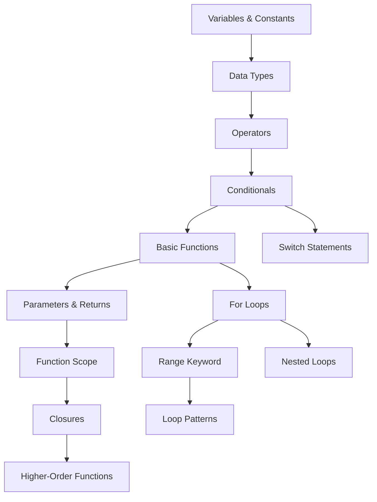

# Learning Roadmap & Dependencies

## 📊 Concept Dependency Graph

## 🎓 Learning Progression

### Stage 1: Foundations (Basics Module)
**Files**: `basics/variables.go` → `basics/operators.go` → `basics/conditionals.go`

1. **Variables & Constants**
   - `var` keyword declarations
   - `:=` short declarations
   - Zero values
   - Constants with `const`

2. **Data Types**
   - Basic types: int, string, bool, float64
   - Type conversion
   - Type inference

3. **Operators**
   - Arithmetic: +, -, *, /, %
   - Assignment operators
   - Comparison operators

4. **Control Flow**
   - if/else statements
   - Switch statements
   - Conditional logic

### Stage 2: Functions (Functions Module)
**File**: `functions/functions.go`

5. **Basic Functions**
   - Function declaration syntax
   - Single returns
   - Multiple returns
   - Named returns

6. **Advanced Functions**
   - Error handling patterns
   - Variable scope
   - Anonymous functions
   - Closures
   - Higher-order functions

7. **Special Features**
   - Variadic functions
   - Defer statements
   - Recursion
   - Methods (functions with receivers)

### Stage 3: Iteration (Loops Module)
**File**: `loops/loops.go`

8. **Loop Fundamentals**
   - Traditional for loops
   - While-style loops
   - Infinite loops

9. **Advanced Iteration**
   - Range over slices/arrays
   - Range over maps
   - Range over strings
   - Break and continue
   - Labeled statements

10. **Patterns & Performance**
    - Filtering patterns
    - Transformation patterns
    - Accumulation patterns
    - Performance optimizations

## 🔗 Concept Dependencies

| Concept | Requires | Enables |
|---------|----------|---------|
| Variables | - | All other concepts |
| Data Types | Variables | Type conversion, Operators |
| Operators | Data Types | Conditionals, Loops |
| Conditionals | Operators | Control flow in functions |
| Functions | Variables, Conditionals | Closures, Higher-order |
| Loops | Conditionals | Range, Patterns |
| Closures | Functions, Scope | Higher-order functions |
| Range | Loops | Idiomatic Go iteration |

## 💡 AI Guidance

When adding new concepts:
1. Identify prerequisites from the dependency graph
2. Place new content after all dependencies are covered
3. Update demo runners to showcase new concepts
4. Maintain progressive complexity
5. Add bridging examples between concepts 